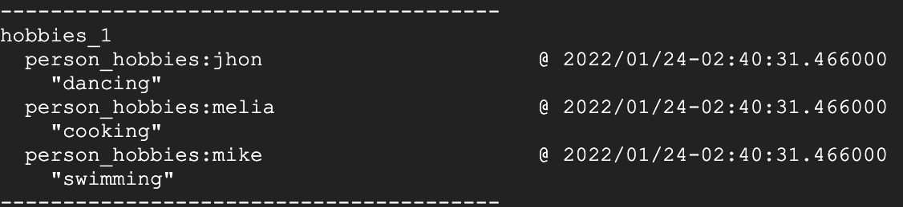
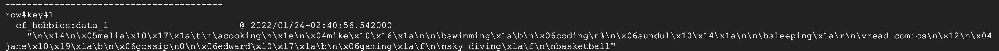

# explore-dataflow

# dependency
* install apache-beam for gcp: `pipenv install 'apache-beam[gcp]'`
* install [google cloud bigtable](https://googleapis.dev/python/bigtable/latest/index.html): `pipenv install google-cloud-bigtable`

# notes

### apache-beam in general
* `apache-beam` only works for python version 3.8.9 and below
* using `'apache-beam[gcp]'`, will automatically create dataflow job when run the script
* can create multiple job in dataflow with the same `job_name`

### apache-beam usage
* apache-beam runners: https://beam.apache.org/documentation/#available-runners
* `createDispposition`, `writeDisposition`, `schema`, & **bigquery data type** : https://beam.apache.org/documentation/io/built-in/google-bigquery/#writing-to-bigquery
* using `FlatMap` in apache-beam: https://beam.apache.org/documentation/transforms/python/elementwise/flatmap/
* using `ParDo` in apache-beam: https://beam.apache.org/documentation/transforms/python/elementwise/pardo/
* using `CombinePerKey` to count words: https://beam.apache.org/documentation/transforms/python/aggregation/combineperkey/

### apache-beam read from pubsub
* using `readfrompubsub`: https://beam.apache.org/releases/pydoc/2.8.0/apache_beam.io.gcp.pubsub.html?highlight=readfrompubsub
* when pipeline read from pubsub, it has to be a **streaming** pipeline

### deal with bigtable
* write & read to cloud bigtable: https://cloud.google.com/bigtable/docs/reading-data#single-row
* python bigtable row: https://googleapis.dev/python/bigtable/latest/row.html
* setup cloud shell terminal to access bigtable: https://cloud.google.com/bigtable/docs/quickstart-cbt
* cbt command list: https://cloud.google.com/bigtable/docs/cbt-reference
* need to create the **columnfamily** first if want to insert data to bigtable via code. Can create **columnfamily** via gcp console or cloud shell

#### bigtable data
* `bigtable/write_read_without_proto.py` will read & write bigtable data as **normal** byte string:

input:
```
[
    {'person': 'mike', 'hobby': 'swimming'},
    {'person': 'jhon', 'hobby': 'dancing'},
    {'person': 'melia', 'hobby': 'cooking'}
]
```

stored on bigtable:


read:
```
[
    {'jhon': ['dancing']}, 
    {'melia': ['cooking']}, 
    {'mike': ['swimming']}
]
```

* `bigtable/write_read_using_proto.py` will read & write bigtable data as **dictionary** byte string:

input:
```
[
    {'person': 'melia', 'age': 23, 'hobbies': ['cooking']},
    {'person': 'mike', 'age': 22, 'hobbies': ['swimming', 'coding']},
    {'person': 'sundul', 'age': 20, 'hobbies': ['sleeping', 'read comics']},
    {'person': 'jane', 'age': 25, 'hobbies': ['gossip']},
    {'person': 'edward', 'age': 23, 'hobbies': ['gaming', 'sky diving', 'basketball']}
]
```

stored on bigtable:


read:
```
person {
  name: "melia"
  age: 23
  hobbies {
    name: "cooking"
  }
}
person {
  name: "mike"
  age: 22
  hobbies {
    name: "swimming"
  }
  hobbies {
    name: "coding"
  }
}
person {
  name: "sundul"
  age: 20
  hobbies {
    name: "sleeping"
  }
  hobbies {
    name: "read comics"
  }
}
person {
  name: "jane"
  age: 25
  hobbies {
    name: "gossip"
  }
}
person {
  name: "edward"
  age: 23
  hobbies {
    name: "gaming"
  }
  hobbies {
    name: "sky diving"
  }
  hobbies {
    name: "basketball"
  }
}
```