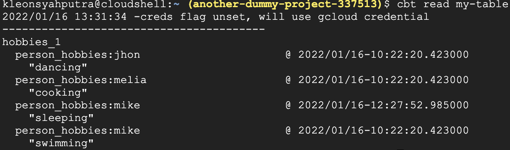

# explore-dataflow

# dependency
* install apache-beam for gcp: `pipenv install 'apache-beam[gcp]'`
* install [google cloud bigtable](https://googleapis.dev/python/bigtable/latest/index.html): `pipenv install google-cloud-bigtable`

# notes

### apache-beam in general
* `apache-beam` only works for python version 3.8.9 and below
* using `'apache-beam[gcp]'`, will automatically create dataflow job when run the script
* can create multiple job in dataflow with the same `job_name`

### apache-beam usage
* apache-beam runners: https://beam.apache.org/documentation/#available-runners
* `createDispposition`, `writeDisposition`, `schema`, & **bigquery data type** : https://beam.apache.org/documentation/io/built-in/google-bigquery/#writing-to-bigquery
* using `FlatMap` in apache-beam: https://beam.apache.org/documentation/transforms/python/elementwise/flatmap/
* using `ParDo` in apache-beam: https://beam.apache.org/documentation/transforms/python/elementwise/pardo/
* using `CombinePerKey` to count words: https://beam.apache.org/documentation/transforms/python/aggregation/combineperkey/

### apache-beam read from pubsub
* using `readfrompubsub`: https://beam.apache.org/releases/pydoc/2.8.0/apache_beam.io.gcp.pubsub.html?highlight=readfrompubsub
* when pipeline read from pubsub, it has to be a **streaming** pipeline


### deal with bigtable
* write & read to cloud bigtable: https://cloud.google.com/bigtable/docs/reading-data#single-row
* setup cloud shell terminal to access bigtable: https://cloud.google.com/bigtable/docs/quickstart-cbt
* cbt command list: https://cloud.google.com/bigtable/docs/cbt-reference
* need to create the **columnfamily** first if want to insert data to bigtable via code. Can create **columnfamily** via gcp console or cloud shell
* `write_read_bigtable.py` will read bigtable data
 as python dictionary:
```
[
    {'jhon': ['dancing']}, 
    {'melia': ['cooking']}, 
    {'mike': ['sleeping', 'swimming']}
]
```